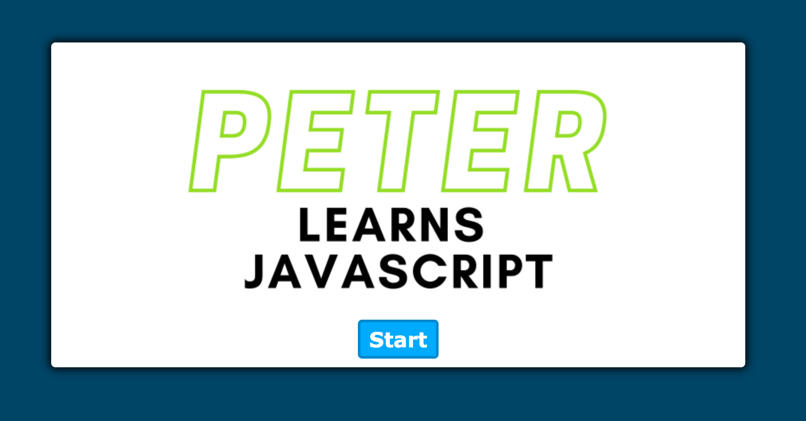

<!-- Week Three Homework Readme Readme -->
# Week 4 Project - Javascript Quiz Game
## Table of Contents
1. [Prerequisites](#prerequisites)
2. [Languages Used](#languages-used)
3. [The Task](#the-task)
3. [How to Install](#how-to-install)
4. [Developer Notes](#developer-notes)
5. [Screenshots](#screenshots)
6. [Links](#links)
7. [Acknowledgements](#acknowledgements)
---
## Prerequisites

Before you begin, ensure you have met the following requirements:

- You have a Windows, macOS or Linux machine.
- You have installed the latest version of Git, VSCode, and Google Chrome.
- SSH key should be connected to Github.

--- 

## Languages Used

- Javascript
- HTML
- CSS 

---

## The Task

- The task for the week: "At some point in your journey to become a full-stack web developer, you’ll likely be asked to complete a coding assessment&mdash;perhaps as part of an interview process. A typical coding assessment includes both multiple-choice questions and interactive coding challenges. To help familiarize you with these tests and allow you to use the skills covered in this module, this Challenge invites you to build a timed coding quiz with multiple-choice questions. This app will run in the browser and will feature dynamically updated HTML and CSS powered by JavaScript code that you write. It will have a clean, polished, and responsive user interface. "


### <span style="color:grey;">**Logic Followed**</span> 

```
Create the HTML structure:
- Create a container for the quiz.
- Add a title and description.
- Add a start button.
- Add a container for questions, which will be populated dynamically.
- Add a container for the results, including a form for initials and a submit button.
Create CSS styles:
- Style the quiz container, title, description, buttons, and question container.
- Add responsive design styles for different screen sizes.
JavaScript Functionality: 
- Create an array of objects containing questions, choices, and the correct answer.
- Add an event listener for the start button to start the quiz.
- Create a function to start the timer and display the first question.
- Create a function to render questions and choices.
- Add event listeners for each choice and determine if the answer is correct or incorrect.
- If the answer is incorrect, subtract time from the timer.
- Move on to the next question until all questions are answered or the timer reaches 0.
- When the game is over, show the results container with a form for initials and a submit button.
- Create a function to save the score and initials to local storage.
- Add an event listener for the submit button to save the score and initials.
```
---

### **Acceptance Criteria...**

|<span style="color:lightgreen;">**I Want...**</span>                 |<span style="color:lightgreen;">**So that...**</span>                                 |
|--------------------------------------------------------------------|-------------------------------------------------------------------------------------|
|to take a timed quiz on JavaScript fundamentals that stores high scores | I can I can gauge my progress compared to my peers                       |


|<span style="color:red;">**When...**</span>                         |<span style="color:red;">**Then...**</span>                                   |
|----------------------------------------------------------------------|--------------------------------------------------------------                      |
| I click the button to generate a password                            | I am presented with a series of prompts for password criteria                      |


--- 

## How to Install

- [Git](https://github.com/git-guides/install-git): "Git is a distributed version control system that tracks changes in any set of computer files, usually used for coordinating work among programmers collaboratively developing source code during software development. Its goals include speed, data integrity, and support for distributed, non-linear workflows." -Wiki
- [SSH Key](https://docs.github.com/en/authentication/connecting-to-github-with-ssh/adding-a-new-ssh-key-to-your-github-account): "Ssh-keygen is a standard component of the Secure Shell protocol suite found on Unix, Unix-like and Microsoft Windows computer systems used to establish secure shell sessions between remote computers over insecure networks, through the use of various cryptographic techniques." -Wiki
- [Github Account](https://docs.github.com/en/get-started/onboarding/getting-started-with-your-github-account): "With a GitHub account, you can import or create repositories, collaborate with others, and connect with the GitHub community. This guide will walk you through setting up your GitHub account and getting started with GitHub's features for collaboration and community." -Github
- [VS Code](https://code.visualstudio.com/docs/setup/setup-overview): "Visual Studio Code, also commonly referred to as VS Code, is a source-code editor made by Microsoft with the Electron Framework, for Windows, Linux and macOS. Features include support for debugging, syntax highlighting, intelligent code completion, snippets, code refactoring, and embedded Git." -Wiki
- [Google Chrome](https://support.google.com/chrome/answer/95346?hl=en&co=GENIE.Platform%3DDesktop): "Google Chrome is a cross-platform web browser developed by Google. It was first released in 2008 for Microsoft Windows, built with free software components from Apple WebKit and Mozilla Firefox. Versions were later released for Linux, macOS, iOS, and also for Android, where it is the default browser." -Wiki
--- 

## Developer Notes

  I started by building and stlying the HTML and CSS then adding the JS to it. I was able to try a new techniques out with math.Random by getting a number that was either negative or a positive to sort the questions. After finishing the project I am starting to fill in questions I've always had. My goal is to be able to get a job when the course is done, so no feedback is too honest. I hope you enjoy the game.

---

## Screenshots


---

## Links

- [Github Link](https://github.com/Peterksharma/quiz-game)
- [Deployed Website](peterksharma.github.io/quiz-game/)

--- 

## Acknowledgements

- Video Tutorial followed: [Link here](https://www.youtube.com/watch?v=riDzcEQbX6k&list=PLya1J2hePgsPfp-mQwsIt8Z5v-vQtjuPW&index=19&t=61s&ab_channel=WebDevSimplified)
- Ethan Cho, Class TA